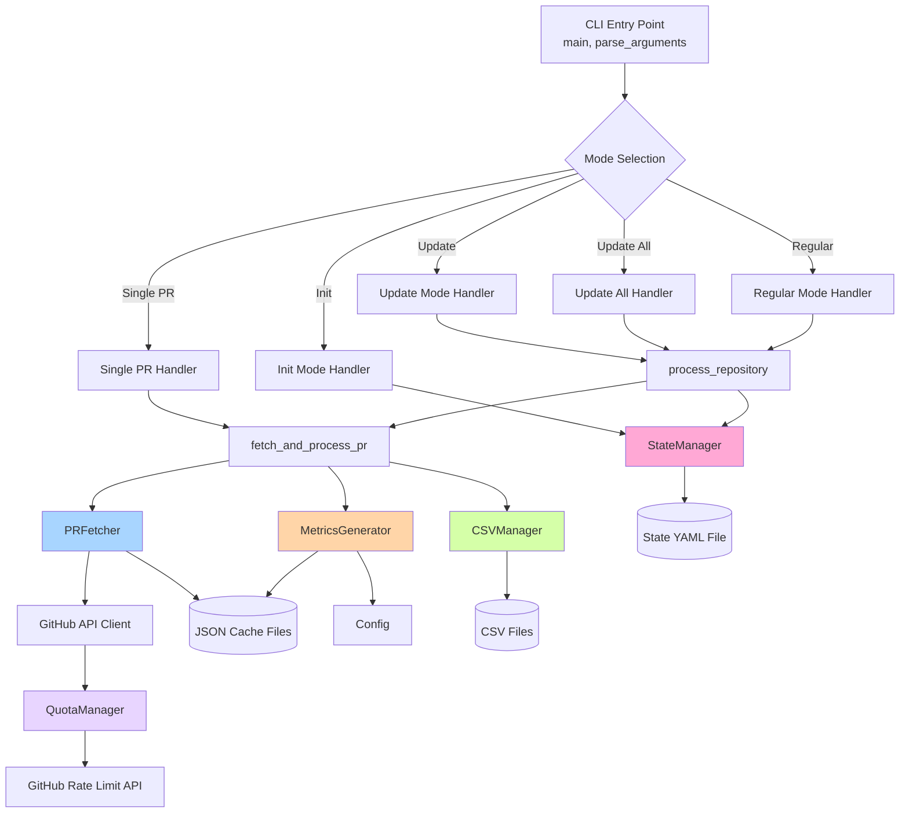
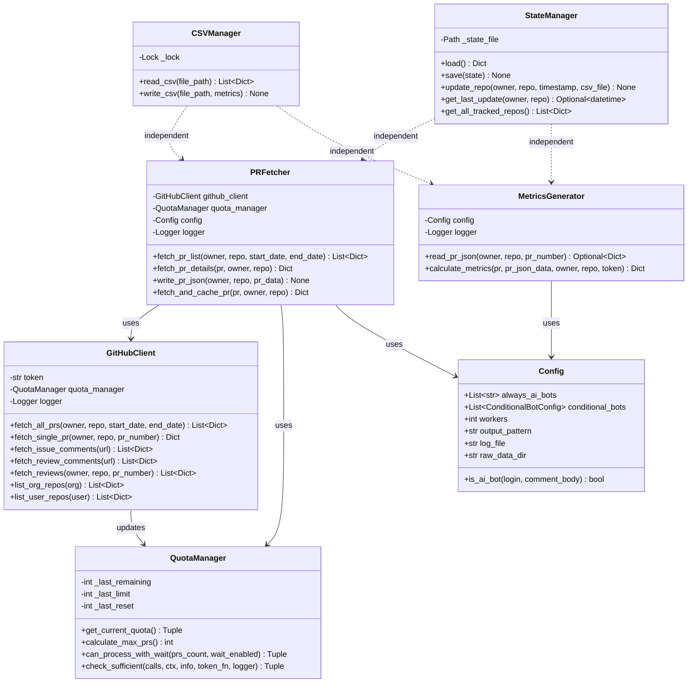
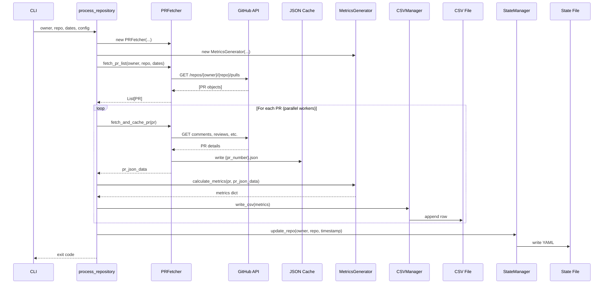
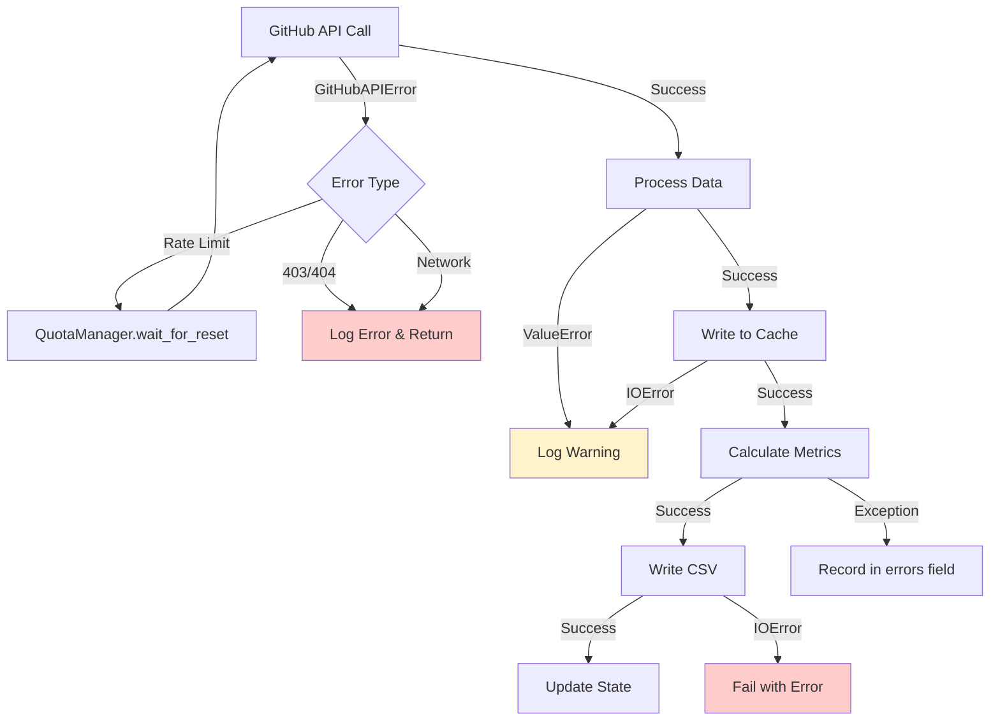

# Class Diagram: gh-pr-metrics Architecture

## System Overview

The `gh-pr-metrics` tool is organized into distinct classes with clear responsibilities for fetching data, calculating metrics, managing state, and handling I/O operations.

---

## High-Level Architecture



---

## Class Relationships



---

## Data Flow Architecture



---

## Component Responsibilities

### Core Processing Classes

#### PRFetcher
**Purpose**: Fetch PR data from GitHub API and cache as JSON

**Responsibilities**:
- Query GitHub API for PR lists and details
- Handle API pagination
- Fetch supplemental data (comments, reviews, timeline)
- Write complete PR data to JSON cache files
- Respect API rate limits (via QuotaManager)

**Dependencies**: GitHubClient, QuotaManager, Config, Logger

**Output**: JSON files in `data/raw/github.com/{owner}/{repo}/{pr_number}.json`

---

#### MetricsGenerator
**Purpose**: Calculate metrics from PR JSON data

**Responsibilities**:
- Read PR data from JSON cache (or accept fresh data)
- Apply AI bot detection rules (from Config)
- Calculate time-based metrics (days_open, days_in_review)
- Count comments and reviews
- Determine PR status
- Calculate complexity metrics (lines, files)
- Return metrics dictionary ready for CSV

**Dependencies**: Config, Logger

**Input**: PR JSON data (from cache or fresh)  
**Output**: Metrics dictionary

---

### I/O Management Classes

#### CSVManager
**Purpose**: Thread-safe CSV file operations

**Responsibilities**:
- Read existing CSV files into memory
- Write metrics to CSV files
- Handle CSV headers
- Merge mode: update existing rows, add new rows
- Thread safety via lock (multiple workers writing)

**Dependencies**: None (standalone)

**Format**: CSV with standardized column headers

---

#### StateManager
**Purpose**: Track processing state across runs

**Responsibilities**:
- Load/save state from YAML file (`~/.gh-pr-metrics-state.yaml`)
- Track last successful fetch timestamp per repository
- Store CSV output file path per repository
- Enable incremental updates (--update mode)
- Get list of all tracked repositories

**Dependencies**: None (standalone)

**State Structure**:
```yaml
https://github.com/{owner}/{repo}:
  timestamp: "2025-12-08T12:00:00Z"
  csv_file: "data/owner_repo.csv"
```

---

### API Management Classes

#### GitHubClient
**Purpose**: Low-level GitHub API interaction

**Responsibilities**:
- Make authenticated API requests
- Handle pagination automatically
- Parse API responses
- Update quota manager with rate limit info
- Implement retry logic
- Validate repository access

**Dependencies**: QuotaManager, Logger

**API Endpoints Used**:
- `/repos/{owner}/{repo}/pulls` - List PRs
- `/repos/{owner}/{repo}/pulls/{number}` - Single PR
- `/repos/{owner}/{repo}/issues/{number}/comments` - Issue comments
- `/repos/{owner}/{repo}/pulls/{number}/comments` - Review comments
- `/repos/{owner}/{repo}/pulls/{number}/reviews` - Reviews
- `/orgs/{org}/repos` - List org repos
- `/users/{user}/repos` - List user repos
- `/rate_limit` - Check quota

---

#### QuotaManager
**Purpose**: Manage GitHub API rate limits

**Responsibilities**:
- Track current rate limit status (remaining, limit, reset time)
- Calculate maximum PRs processable with current quota
- Determine if sufficient quota exists for operation
- Implement wait logic when quota exhausted
- Prevent complete quota exhaustion (reserve buffer)

**Dependencies**: None (singleton, updated by GitHubClient)

**Key Metrics**:
- Reserve buffer: 50 calls minimum
- Calls per PR: ~5 (base + comments + reviews + timeline + buffer)
- Reset time tracking for wait logic

---

### Configuration

#### Config
**Purpose**: Application configuration from YAML file

**Responsibilities**:
- Load settings from `.gh-pr-metrics.yaml`
- Provide defaults for missing settings
- AI bot detection configuration (always + conditional bots)
- Worker count for parallel processing
- Output file patterns
- Log file location
- Raw data directory path

**Configuration Options**:
- `ai_bots.always`: List of bot names (regex) always classified as AI
- `ai_bots.conditional`: Bots classified as AI based on content patterns
- `workers`: Number of parallel workers (default: 4)
- `output_pattern`: Template for output CSV files
- `log_file`: Log file location
- `raw_data_dir`: Base directory for JSON cache

---

## Key Design Patterns

### 1. **Separation of Concerns**
- **Fetch**: PRFetcher handles all API interaction
- **Transform**: MetricsGenerator handles all metric calculation
- **Load**: CSVManager handles all CSV I/O
- **State**: StateManager handles persistence

### 2. **Dependency Injection**
Classes receive their dependencies via constructor:
```python
pr_fetcher = PRFetcher(github_client, quota_manager, config, logger)
metrics_gen = MetricsGenerator(config, logger)
```

Benefits:
- Easy to test with mocks
- Clear dependencies
- Flexible composition

### 3. **Single Responsibility**
Each class has one primary job:
- PRFetcher: Fetch data
- MetricsGenerator: Calculate metrics
- CSVManager: CSV I/O
- StateManager: State persistence
- QuotaManager: Rate limiting

### 4. **Thread Safety**
CSVManager uses locks for concurrent writes:
```python
class CSVManager:
    def __init__(self):
        self._lock = threading.Lock()
    
    def write_csv(self, ...):
        with self._lock:
            # Thread-safe write
```

### 5. **Caching Strategy**
Two-tier caching:
1. **JSON Cache** (data/raw/): Complete PR data from API
2. **State File** (~/.gh-pr-metrics-state.yaml): Last fetch timestamp

Enables:
- Incremental updates (--update mode)
- CSV regeneration without API calls
- Resume after failures

---

## Integration Points

### CLI → Classes
```python
def main():
    config = load_config()
    github_client = GitHubClient(token, quota_manager, logger)
    
    # Create instances
    pr_fetcher = PRFetcher(github_client, quota_manager, config, logger)
    metrics_generator = MetricsGenerator(config, logger)
    csv_manager = CSVManager()
    
    # Process
    for pr in prs:
        pr_json = pr_fetcher.fetch_and_cache_pr(pr, owner, repo)
        metrics = metrics_generator.calculate_metrics(pr, pr_json, ...)
        csv_manager.write_csv(output_file, [metrics])
    
    state_manager.update_repo(owner, repo, timestamp, output_file)
```

### Future: Subcommands (Phase 4)

#### Fetch Subcommand
```python
def cmd_fetch(args, config):
    pr_fetcher = PRFetcher(...)
    # Use ONLY pr_fetcher, no metrics calculation
    all_prs = pr_fetcher.fetch_pr_list(owner, repo, start, end)
    for pr in all_prs:
        pr_fetcher.fetch_and_cache_pr(pr, owner, repo)
    state_manager.update_repo(...)
```

#### CSV Subcommand
```python
def cmd_csv(args, config):
    metrics_generator = MetricsGenerator(config, logger)
    # Use ONLY metrics_generator, no API calls
    for pr_number in cached_prs:
        pr_json = metrics_generator.read_pr_json(owner, repo, pr_number)
        metrics = metrics_generator.calculate_metrics(..., pr_json, ...)
        csv_manager.write_csv(output_file, [metrics])
```

---

## Error Handling Architecture



### Known Issue: Silent Data Loss
**Current behavior** (bug to fix):
- API errors for comments/reviews logged at debug level only
- Empty data returned, processing continues
- CSV shows 0 comments/reviews with no warning
- **Location**: Lines 677, 697, 715 in PRFetcher.fetch_pr_details()

**Should be**:
- Log at warning level minimum
- Record in CSV `errors` field
- Consider failing entire PR fetch on critical data loss

---

## File System Layout

```
Project Root/
├── data/
│   ├── raw/                    # JSON cache (managed by PRFetcher)
│   │   └── github.com/
│   │       └── {owner}/
│   │           └── {repo}/
│   │               ├── 1.json      # PR #1 complete data
│   │               ├── 2.json      # PR #2 complete data
│   │               └── ...
│   └── {owner}_{repo}.csv      # CSV output (managed by CSVManager)
│
├── ~/.gh-pr-metrics-state.yaml # State file (managed by StateManager)
│
└── gh-pr-metrics.log           # Log file
```

---

## Scalability Characteristics

### Parallel Processing
- **Worker pool**: ThreadPoolExecutor with configurable workers
- **Thread-safe**: CSVManager uses locks
- **Bottleneck**: GitHub API rate limits (5000 calls/hour)

### Memory Usage
- **Streaming**: Process PRs in chunks (default: 100)
- **JSON cache**: One file per PR (not held in memory)
- **CSV**: Incremental writes (not loaded fully)

### Rate Limiting
- **Quota aware**: Checks before each chunk
- **Graceful degradation**: Stops when quota low
- **Resume support**: State file tracks progress

---

## Testing Strategy

### Unit Tests (Current: 246 tests)
- Individual function testing
- Mocked GitHub API responses
- State file manipulation
- Config loading
- Date parsing
- AI bot detection

### Integration Tests (Recommended)
- PRFetcher → JSON cache → MetricsGenerator → CSV
- Full pipeline with real file I/O
- State persistence across runs

### Future: Class-Specific Tests
```python
def test_pr_fetcher_caches_json(mocker):
    github_mock = mocker.Mock(spec=GitHubClient)
    pr_fetcher = PRFetcher(github_mock, quota_manager, config, logger)
    
    pr_data = pr_fetcher.fetch_and_cache_pr(pr, owner, repo)
    
    # Verify JSON file written
    assert json_file.exists()
    assert json.loads(json_file.read()) == pr_data

def test_metrics_generator_reads_cache():
    metrics_gen = MetricsGenerator(config, logger)
    
    pr_json = metrics_gen.read_pr_json(owner, repo, pr_number)
    
    assert pr_json is not None
    assert pr_json['pr_number'] == pr_number
```

---

## Summary

**Strengths**:
- ✅ Clear separation of concerns
- ✅ Each class has single responsibility
- ✅ Dependency injection for testability
- ✅ Thread-safe concurrent processing
- ✅ Caching for efficiency
- ✅ State management for incremental updates

**Areas for Improvement**:
- ⚠️ Error handling: Silent data loss on API errors (debug logging only)
- ⚠️ Retry logic: Could be more sophisticated
- ⚠️ Monitoring: No metrics on data completeness
- ⚠️ Validation: JSON cache files not validated on read

**Architecture Readiness**:
- ✅ Ready for fetch/csv subcommands (Phase 4)
- ✅ Easy to add new data sources (not just GitHub)
- ✅ Easy to add new metrics (MetricsGenerator)
- ✅ Easy to add new output formats (not just CSV)

