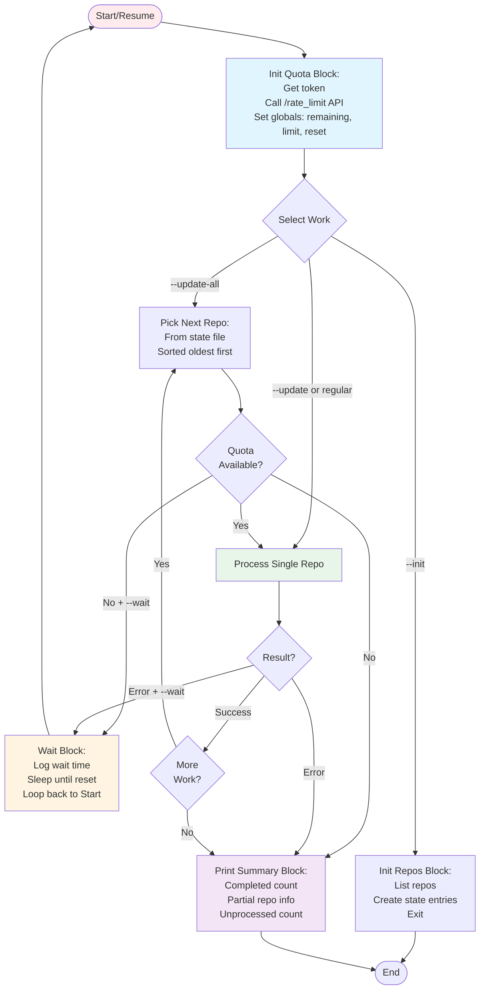
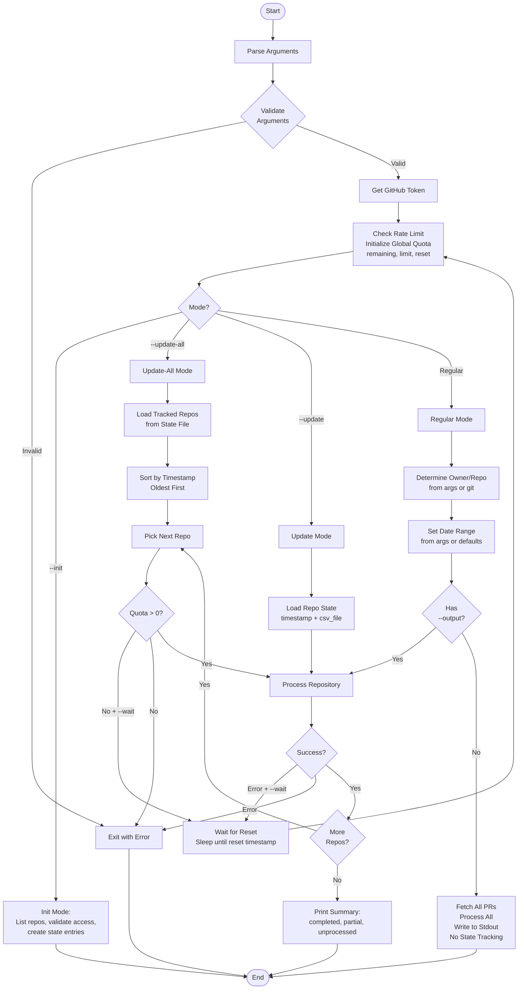
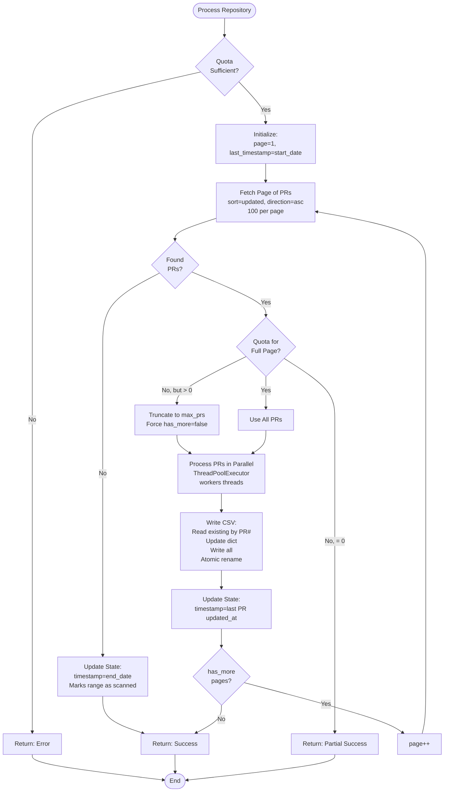
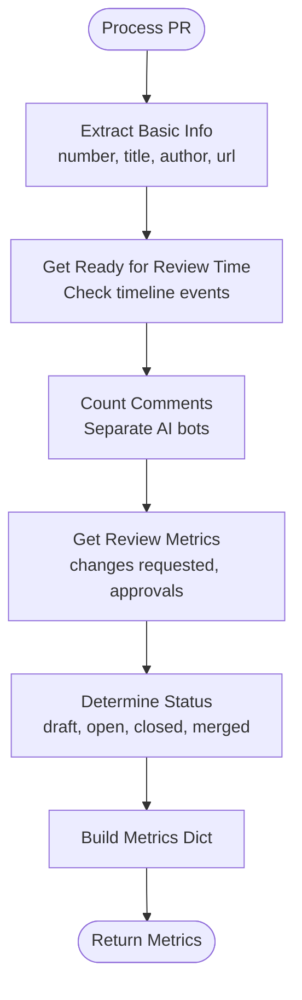
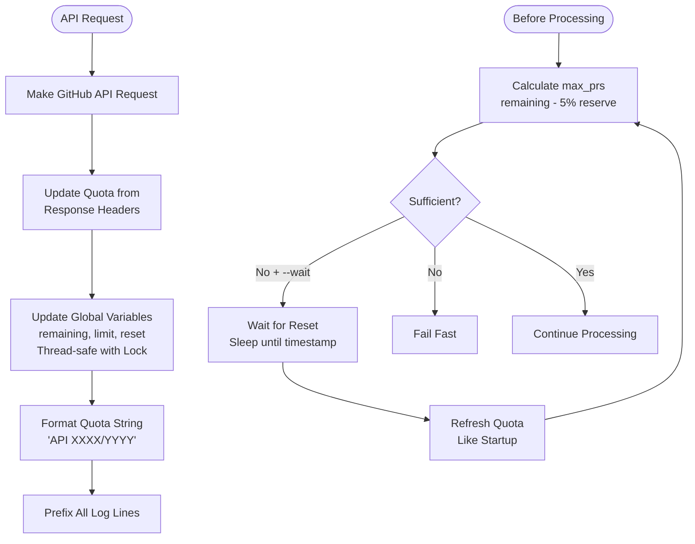
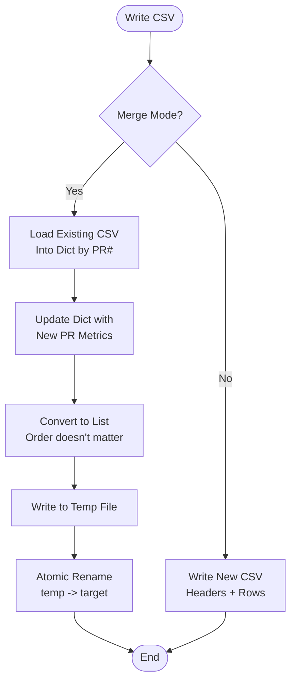

# GitHub PR Metrics - Logic Flow

Generated By: Cursor (Claude Sonnet 4.5)

## Super High-Level: Core Blocks & Flow



### Block Commonalities

**Init Quota Block** (Used by):
- Startup (always)
- Post-wait resume (loops back)
- **Key**: Single source of truth for quota initialization

**Wait Block** (Triggered by):
- Quota exhausted at update-all start
- Quota exhausted between repos  
- **Key**: Same logic, always loops back to Init Quota

**Print Summary Block** (Used by):
- Normal completion
- Error/exhaustion without --wait
- **Key**: Terminal state, shows progress made

**Process Single Repo** (Used by):
- Update-all loop (per repo)
- Update mode (one repo)
- Regular mode (one repo)
- **Key**: Shared processing logic for all modes

### Resume After Wait

```
Wait Block → Start → Init Quota Block
              ↓
         Reinitialize globals (remaining, limit, reset)
              ↓
         Return to original work (update-all loop continues)
```

**No special refresh code** - just restart initialization and continue.

## High-Level Flow



## Repository Processing Flow



## PR Processing Flow



## Quota Management Flow



## State File Management Flow

```mermaid
flowchart TD
    Start([State Operations]) --> Operation{Operation?}
    
    Operation -->|Load| LoadYAML[Load ~/.gh-pr-metrics-state.yaml]
    LoadYAML --> ParseState[Parse YAML<br/>repo_url -> {timestamp, csv_file}]
    
    Operation -->|Save| BuildState[Build State Dict<br/>https://github.com/owner/repo]
    BuildState --> WriteYAML[Write YAML<br/>Sorted by Keys]
    
    Operation -->|Update| GetRepoState[Get Repo State Entry]
    GetRepoState --> ValidateEntry{Valid?}
    ValidateEntry -->|No| ErrorState[Error: Invalid State]
    ValidateEntry -->|Yes| ExtractData[Extract timestamp + csv_file]
    ExtractData --> ReturnData[Return Data]
    
    Operation -->|Get All| LoadAll[Load All Repos]
    LoadAll --> SortByTime[Sort by Timestamp<br/>Oldest First]
    SortByTime --> ReturnList[Return List]
    
    ParseState --> End([End])
    WriteYAML --> End
    ErrorState --> End
    ReturnData --> End
    ReturnList --> End
```

## CSV Merge Flow



## Key Design Decisions

### Unified Initialization
- **Single entry point**: All flows (startup, post-wait) go through "Check Rate Limit"
- **No special refresh**: Waiting just restarts from the top
- **Simplifies logic**: One place to initialize quota tracking

### Quota-Driven Iteration
- **Check before each repo**: Not just at start of update-all
- **Global quota check in loop**: `Pick Next Repo → Quota > 0? → Process`
- **Efficiency**: Skip iteration overhead when quota exhausted
- **Optimization opportunity**: Could check quota once per repo instead of per-page

### Page-Based Processing
- Fetch 100 PRs per page (sorted by `updated` ASC - oldest first)
- Process immediately, don't load all into memory
- Truncate page if quota insufficient (process what we can)
- Save state after each page (resume point = last PR timestamp)

### Quota Tracking
- Global variables: `_api_quota_remaining`, `_api_quota_limit`, `_api_quota_reset`
- Updated from every API response header (no extra `/rate_limit` calls)
- Thread-safe with mutex lock
- Visible in all logs: `[API 4693/5000]`

### State Management
- YAML file: `~/.gh-pr-metrics-state.yaml`
- Format: `https://github.com/owner/repo: {timestamp, csv_file}`
- Timestamp = last processed PR's `updated_at` (or `end_date` if none found)
- Enables precise resume and `--update-all` workflow

### Wait Strategy
- Single "Wait for Reset" block used by all flows
- Sleeps until global `_api_quota_reset` timestamp + 15sec buffer
- Loops back to initialization (clean restart)
- No special "refresh" - just reinitialize like startup

