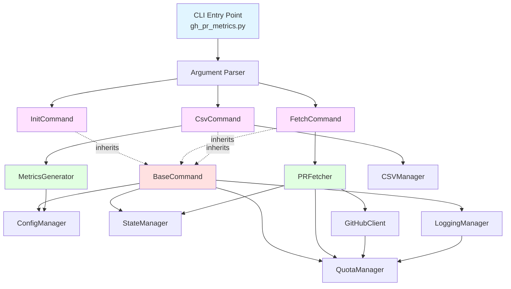

# Architecture - Subcommand Refactor

## Overview

This document describes the architectural design of the refactored `gh-pr-metrics` tool after splitting the monolithic CLI into a clean object-oriented subcommand structure.

## High-Level Architecture



## Dependency Layers

### Layer 1: Base Infrastructure
- `BaseCommand`: Abstract base class for all commands
  - Provides common setup, initialization, and utilities
  - No dependencies on specific commands

### Layer 2: Managers (Independent Utilities)
- `ConfigManager`: Configuration loading and management
- `StateManager`: State file operations
- `QuotaManager`: API rate limit tracking
- `CSVManager`: CSV file I/O
- `LoggingManager`: Logging with quota prefix (depends on QuotaManager only)
- `GitHubClient`: GitHub API client (depends on QuotaManager only)

**Key Properties**:
- Managers are independent of each other (except noted exceptions)
- No circular dependencies
- Can be tested in isolation

### Layer 3: Data Processing
- `PRFetcher`: Fetches PR data from GitHub API
  - Dependencies: GitHubClient, QuotaManager, ConfigManager, StateManager
  - Used by: FetchCommand
  
- `MetricsGenerator`: Calculates metrics from PR JSON data
  - Dependencies: ConfigManager
  - Used by: CsvCommand

### Layer 4: Commands
- `InitCommand`: Initialize repository tracking
  - Dependencies: All Layer 2 managers
  
- `FetchCommand`: Fetch PR data to JSON cache
  - Dependencies: All Layer 2 managers + PRFetcher
  
- `CsvCommand`: Generate CSV from JSON cache
  - Dependencies: ConfigManager, StateManager, LoggingManager, MetricsGenerator, CSVManager
  - Does NOT need: GitHubClient, QuotaManager (no API calls)

## Dependency Rules

1. **No Circular Dependencies**: Higher layers can depend on lower layers only
2. **Same-Layer Independence**: Classes in the same layer should not depend on each other (exceptions documented)
3. **Upward Independence**: Lower layers cannot depend on higher layers

## Verification

This architecture has been verified to have zero circular dependencies:

**Manager Layer**:
- ConfigManager: Independent ✓
- StateManager: Independent ✓
- QuotaManager: Independent ✓
- CSVManager: Independent ✓
- LoggingManager → QuotaManager ✓
- GitHubClient → QuotaManager ✓

**Data Layer**:
- PRFetcher → GitHubClient, QuotaManager, ConfigManager, StateManager ✓
- MetricsGenerator → ConfigManager ✓

**Command Layer**:
- All commands → BaseCommand ✓
- InitCommand → Layer 2 managers ✓
- FetchCommand → Layer 2 managers + PRFetcher ✓
- CsvCommand → Layer 2 managers (subset) + MetricsGenerator ✓

## State Management

### State File Structure

```yaml
https://github.com/owner/repo:
  timestamp: "2024-12-09T12:00:00Z"
  csv_file: "data/owner-repo.csv"
  failed_prs: [123, 456, 789]
```

### State Update Responsibilities

| Component | Creates | Updates Timestamp | Updates csv_file | Updates failed_prs |
|-----------|---------|-------------------|------------------|--------------------|
| InitCommand | Yes | Sets initial | Yes (if --output) | Yes (empty list) |
| FetchCommand | Yes (if missing) | Yes (on success) | No | Yes (always) |
| CsvCommand | No | No | Yes (if --output) | No |

## Command Workflows

### Init Workflow
```
User → init --owner X --repo Y --start DATE --output PATH
  → InitCommand.run()
    → StateManager.update_repo() [creates entry]
    → No API calls
    → No data fetching
```

### Fetch Workflow
```
User → fetch --owner X --repo Y --start DATE
  → FetchCommand.run()
    → PRFetcher.fetch_pr_list()
      → GitHubClient.fetch_all_prs()
    → PRFetcher.fetch_and_cache_pr() [parallel, per PR]
      → GitHubClient [comments, reviews, timeline]
      → Write JSON to cache
    → StateManager.update_repo() [timestamp, failed_prs]
```

### CSV Workflow
```
User → csv --owner X --repo Y --output PATH
  → CsvCommand.run()
    → Read all JSON files from cache
    → MetricsGenerator.calculate_metrics() [per PR]
    → CSVManager.write_csv()
    → StateManager.update_repo() [csv_file only, if --output]
```

## File Organization

```
src/
  gh_pr_metrics.py          # CLI entry, argument parsing, dispatch
  gh_pr_metrics_old.py      # Original (reference, not in coverage)
  github_api.py             # Unchanged
  
  managers/
    __init__.py
    config_manager.py       # Config, load_config
    state_manager.py        # StateManager
    quota_manager.py        # QuotaManager
    csv_manager.py          # CSVManager
    logging_manager.py      # LoggingManager
  
  data/
    __init__.py
    pr_fetcher.py           # PRFetcher
    metrics_generator.py    # MetricsGenerator + helpers
  
  commands/
    __init__.py
    base_command.py         # BaseCommand (abstract)
    init_command.py         # InitCommand
    fetch_command.py        # FetchCommand
    csv_command.py          # CsvCommand
```

## Testing Strategy

### Unit Tests
- Each manager tested independently
- Each command tested with mocked dependencies
- Data processors tested with mocked API clients

### Integration Tests
- Full pipeline: init → fetch → csv
- State file consistency across commands
- Failed PR tracking across operations

### Test Organization
```
tests/
  unit/
    test_commands/         # Command-specific tests
    test_managers/         # Manager tests
    test_data/             # Data processor tests
    [other existing tests updated]
  
  integration/
    test_init_fetch_csv_pipeline.py
    [existing integration tests updated]
```

## Key Design Decisions

### Why Three Commands?

1. **Separation of Concerns**: Fetch (API I/O) vs CSV (computation) have different failure modes
2. **Efficiency**: Re-generate CSV with new config without re-fetching data
3. **Testability**: Each command can be tested independently
4. **Clarity**: Clear mental model of what each command does

### Why BaseCommand?

1. **DRY Principle**: Common setup logic in one place
2. **Consistency**: All commands handle config/logging the same way
3. **Extensibility**: Easy to add new commands
4. **Testing**: Mock BaseCommand.setup() in command tests

### Why Separate Managers?

1. **Reusability**: Managers can be used by multiple commands
2. **Testability**: Each manager tests independently
3. **No Circular Dependencies**: Clear dependency hierarchy
4. **Single Responsibility**: Each manager has one clear purpose

## Migration from Old Architecture

### Before (Monolithic)
- Single 2700-line file
- `main()` function with 5 modes
- `process_repository()` does fetch + metrics + CSV
- Hard to test individual pieces
- Tight coupling throughout

### After (Modular)
- ~200 line main file (dispatch only)
- 3 independent commands
- Clear separation: fetch vs process
- Each module < 500 lines
- Testable in isolation
- Zero circular dependencies

## Future Extensibility

This architecture supports:
- Adding new providers (GitLab, Bitbucket) via GitHubClient interface
- Adding new export formats (JSON, Excel) via new commands
- Adding new metrics via MetricsGenerator
- Adding new storage backends via StateManager interface

All without modifying existing command classes.

